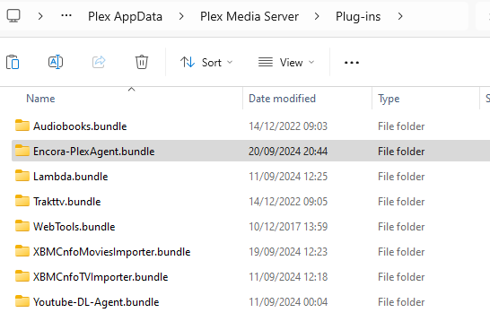
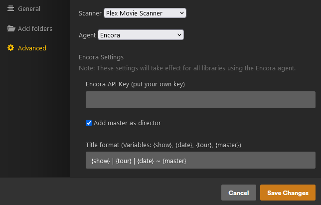
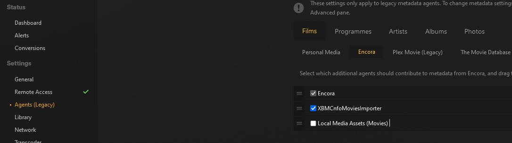

# Encora Plex Agent

This agent will scrape recording data from Encora, including downloading subtitles.
It will also fallback to using [XBMCnfoMoviesImporter](https://github.com/Bubba8291/XBMCnfoMoviesImporter.bundle/archive/master.zip) if no encora ID is found, so that NFO files (created with [NFOBuilder](https://github.com/pekempy/NFOBuilder)) can be used to set the data.

Thanks to [Bubba8291](https://github.com/Bubba8291) for working on the [Headshot Database]() used for the agent.

_Please note: The Encora API is rate limited to 30 requests per minute by default. This means that scanning your full library make take time if you have a large amount of recordings in Plex.
The agent is configured to handle the rate limit and continue processing entries once the limit resets._

---

### Contents

- [Install instructions](#instructions)
- [Fixing missing posters/headshots](#fixing-missing-posters--headshots)

---

### Instructions

- Download the entire repository ([click here](https://github.com/pekempy/Encora-PlexAgent.bundle/archive/refs/heads/main.zip)) and extract the folder inside
- Rename `Encora-PlexAgent.bundle-main` -> `Encora-PlexAgent.bundle`
- Move the .bundle folder to your Plugins Directory
  - By default, this will be:
    - Windows: `%LOCALAPPDATA%\Plex Media Server\Plug-ins`
    - macOS: `~/Library/Application Support/Plex Media Server/Plug-ins`
    - Linux: `$PLEX_HOME/Library/Application Support/Plex Media Server/Plug-ins`
  - It should look like this:  
    
- Create a library in Plex with `Encora` as the agent
- Populate your API Key in the settings
- Configure the naming of Plex items
  
- In your Plex Settings, make sure you enable XBMCnfoMoviesImporter as a backup agent for Encora
  
- Your media items should have `e-{id}` in the name e.g. `Murder Ballad {e-1118317}` **or** have an `.encora-{id}` file inside the folder e.g. `.encora-1118317`
- For non-Encora items, make sure you have an NFO created with [NFOBuilder](https://github.com/pekempy/NFOBuilder), and then `⋮` button -> `Match` -> `Auto Match` dropdown -> `XBMCnfoMoviesImporter`, that should then detect the NFO and pull the data from it.

---

### Fixing missing posters / headshots

If posters or headshots are missing from your Plex after matching on Encora, then you will need to contribute to [the database]().
You can upload images there, and then press the `⋮` button, and `Refresh Metadata` in Plex, and you should now have headshots for those actors/posters for that show in your Plex.
This helps _everyone_ who uses this plugin, not just you!

You will need your own account for this site, so sign up and contribute what you can :)
